# Capital Crashpad: Platform Governance and Airbnb in Washington, DC


*When platforms change the rules, markets respond. This project examines how Airbnb’s 2024 verification expansion reshaped Washington, D.C.’s short-term rental market in size, structure, and revenue distribution.*

🔗 [Live Website](https://johbry17.github.io/Capital-Crashpad/)  
🔗 [Case Study](https://johbry17.github.io/Capital-Crashpad/case_study.html)
<!-- 🔗 [Tableau Dashboard](https://public.tableau.com/app/profile/bryan.johns6699/viz/DC-Airbnb/DCAirbnbMobile)   -->
<!-- 🔗 [Exploratory Data Analysis (EDA)](/exploratory_data_analysis/eda.ipynb) -->

> ℹ️ Status: While not under active development, the dashboard is refreshed semiannually as new data becomes available. Legacy full-stack versions (Flask and Django) are archived in the `/legacy` folder.

## Table of Contents

- [Project Overview](#project-overview)
- [Features](#features)
- [Tools & Technologies](#tools--technologies)
- [Usage](#usage)
- [Gallery](#gallery)
- [Data & Methodology](#data--methodology)
- [References](#references)
- [License](#license)
- [Acknowledgements](#acknowledgements)
- [Author](#author)

## Project Overview

Capital Crashpad analyzes a structural break in Washington, D.C.’s Airbnb market.

In Q2 2024, after Airbnb expanded listing verification requirements, roughly 1,800 listings disappeared from the platform. This project investigates what changed — not just how many listings left, but which ones, and what the market looked like afterward.

The analysis combines:

- An interactive public-facing dashboard (GitHub Pages)
- A structured, narrative case study (nbconverted HTML)
- A PostgreSQL-backed ETL pipeline
- Multi-quarter panel data analysis in Python

Key questions explored:

- Did the market simply shrink — or reorganize?
- Were unlicensed listings disproportionately removed?
- What happened to extended-stay (31+ minimum night) rentals?
- Did revenue decline because low-performers exited — or high earners?
- Did enforcement reduce concentration among top hosts?

The findings suggest the contraction was not random. Listings clustered around the 30-day regulatory threshold declined sharply, driving much of the revenue shift. The platform became smaller, more licensed, more operational — but earnings remained highly concentrated.

This project sits at the intersection of housing policy, platform governance, and data storytelling.

## Features

Interactive Dashboard:

- Multi-metric neighborhood comparison
- Dynamic titles tied to analytical questions
- Density vs scale visualizations
- Revenue concentration analysis
- Interactive filtering by neighborhood and metric

Case Study:

- Structured narrative analysis
- Combined plots for clarity and space efficiency
- Revenue segmentation by minimum-night category
- Before/after structural comparison
- Policy-relevant interpretation without technical jargon

Data Pipeline:

- PostgreSQL database with quarterly snapshots
- SQL aggregation queries for structural metrics
- Jupyter ETL workflow for reproducible updates
- nbconvert automation for HTML publication

Legacy Archive:

- Flask and Django implementations preserved in `/legacy`
- Earlier exploratory dashboards and Tableau version retained for reference

## Tools & Technologies

- **Backend**: Python (Pandas, NumPy), PostgreSQL, SQLAlchemy, Jupyter Notebook
- **Visualization**: Matplotlib, Seaborn, Plotly, Chart.js, Leaflet
- **Frontend**: JavaScript, HTML/CSS, Bootstrap, GitHub Pages Deployment
- **Automation**: Nbconvert for HTML Case Study Export
- **Database**: Structured SQL Views for Reusable Metrics

## Usage

### Explore the Live Version

Visit:  
https://johbry17.github.io/Capital-Crashpad/ 

Navigate between:

- Interactive dashboard views
- Case study analysis (HTML)

### Update the Data

1. Open the ETL notebook:
```
/notebooks/etl_2026.ipynb
```
2. Run all cells to:

- Update quarterly tables
- Regenerate summary views
- Export CSVs for GitHub Pages

3. Regenerate the case study from the command line in `/notebooks`:
```
python export_case_study.py
```

## Gallery

Below are key visualizations from the dashboard and case study:

**Dashboard:**
- 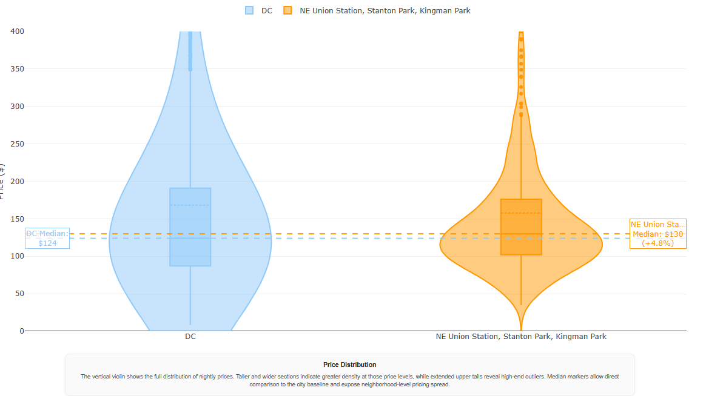  
_Distribution of nightly prices and availability for Airbnb listings, highlighting the median value._  

- 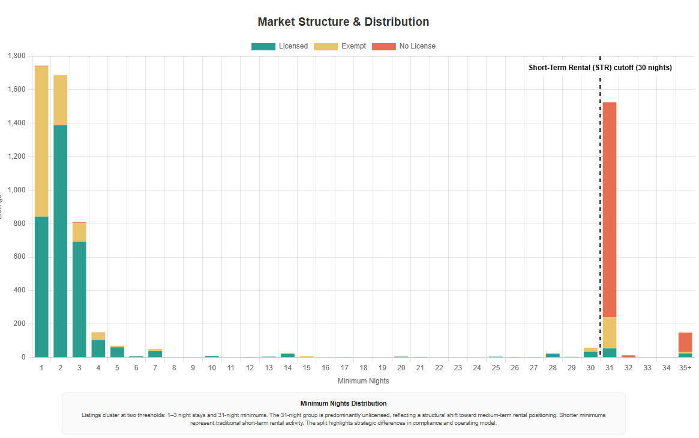  
_Minimum nights required for Airbnb listings, segmented by license status._  

**Interactive Map:**
- 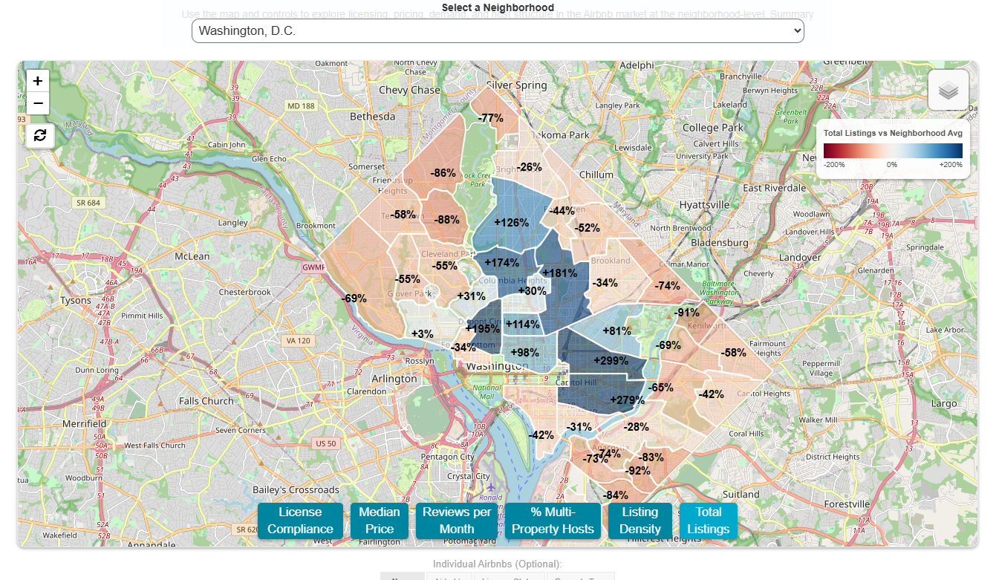  
_Total Airbnb listings by neighborhood, compared to the citywide average._  

- 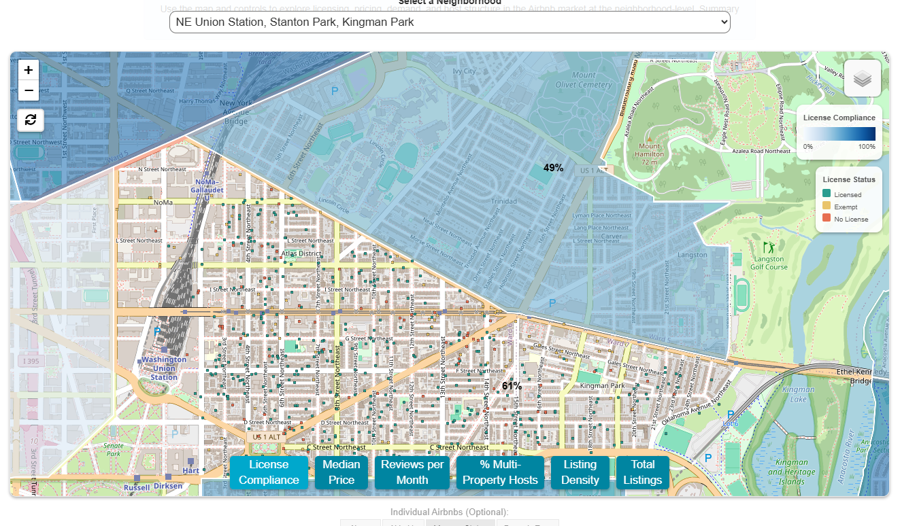  
_License status of Airbnb listings within a selected neighborhood._  

- 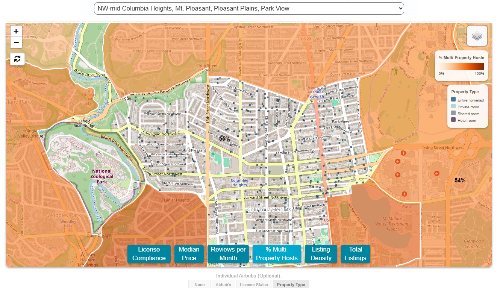  
_Distribution of Airbnb property types in a highlighted neighborhood._  

- 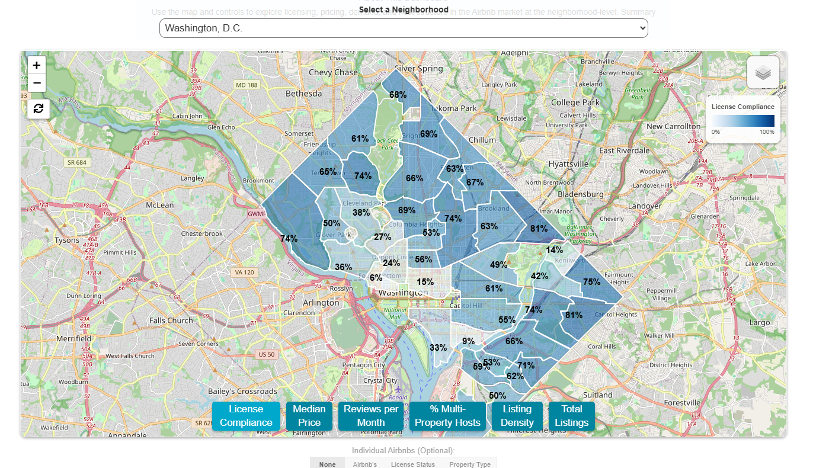  
_Percentage of licensed Airbnb listings in each neighborhood._  

- 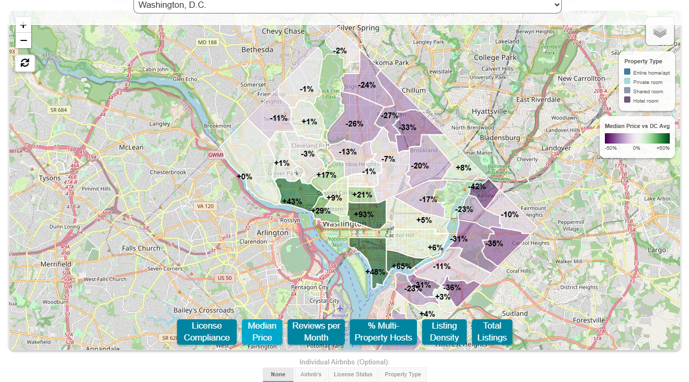  
_Median Airbnb price per neighborhood, relative to the citywide median._  

**Case Study:**
- 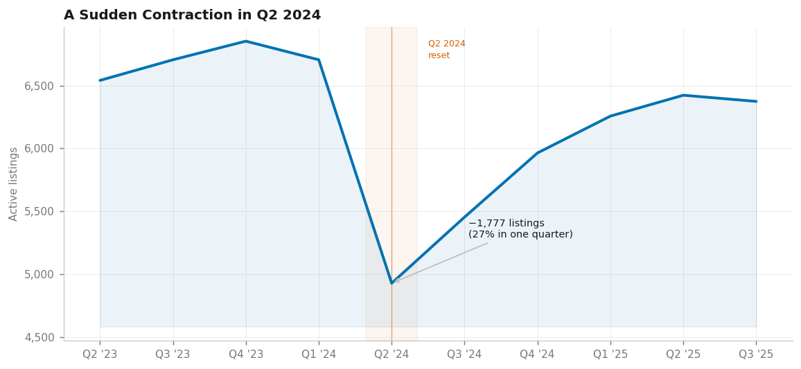  
_Sharp decline and partial rebound in Airbnb listings following verification expansion._  

- 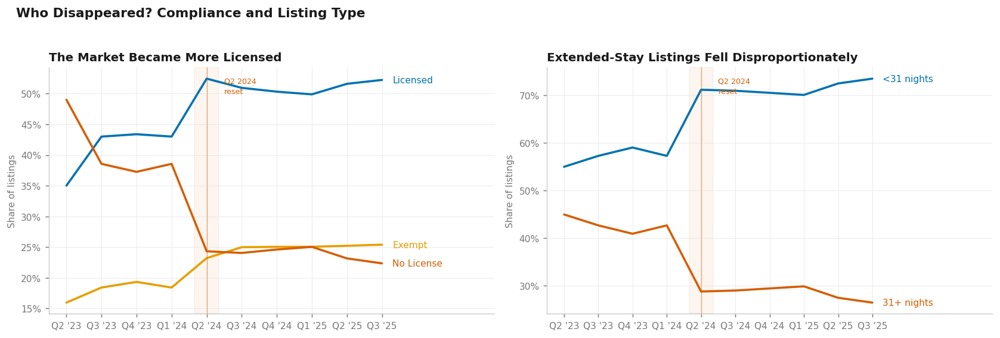  
_Increase in the share of licensed Airbnb listings after enforcement._  

- 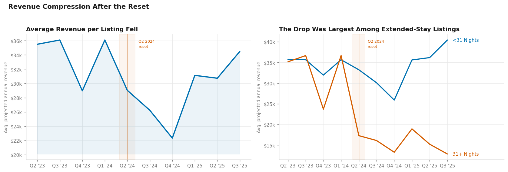  
_Revenue decline in extended-stay Airbnb listings post-verification._  

- 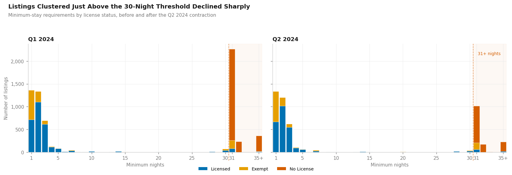  
_Decrease in unlicensed extended-stay listings after policy change._  

- 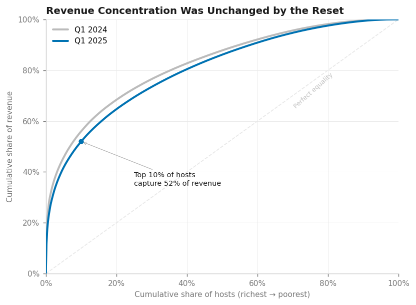  
_Lorenz curves showing persistent concentration of Airbnb revenue among top hosts before and after verification._  

- 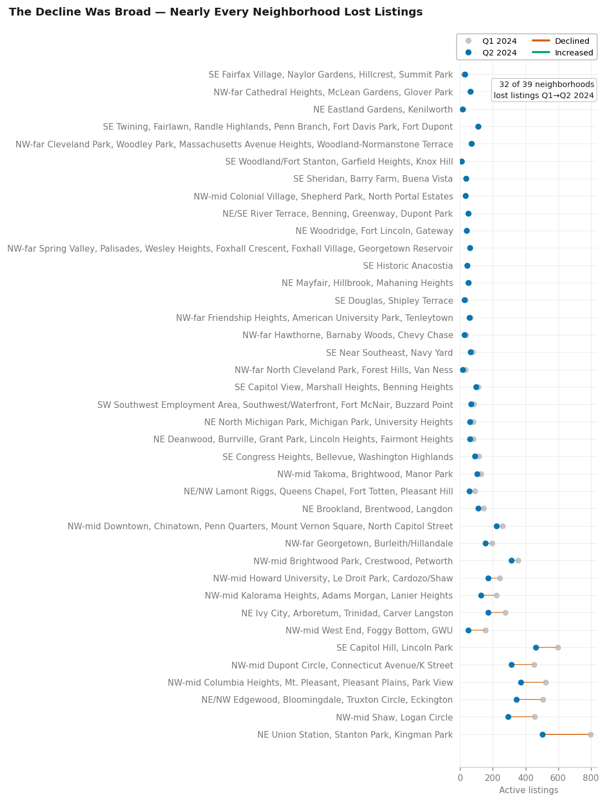  
_Neighborhoods with higher licensing rates and greater listing availability._  

## Data & Methodology

Primary dataset: Inside Airbnb quarterly scrape data.

Revenue estimates are derived from `price * (365 - availability_365)`. This serves as a directional proxy for annualized booking value. Results should be interpreted structurally rather than as exact financial totals.

Neighborhood population data used for per-1,000 density metrics.

Analysis covers multiple quarterly snapshots to identify structural inflection rather than seasonal fluctuation.

## References

Dataset provided by [Inside AirBnB](http://insideairbnb.com/about/).

Neighborhood population and housing unit data from [Census Reporter](https://censusreporter.org/).

## License

[Creative Commons Attribution 4.0 International License](http://creativecommons.org/licenses/by/4.0/)

## Acknowledgements

- Thanks to Imen Najar for early insights and support.
- Thanks to Geronimo Perez for feedback and assistance during development.

## Author

Bryan Johns, February 2026  
[bryan.johns@informedwanderer.com](mailto:bryan.johns@informedwanderer.com) | [LinkedIn](https://www.linkedin.com/in/b-johns/) | [GitHub](https://github.com/johbry17) | [Portfolio](https://informedwanderer.com)  
— Fluent in Data. Fluent in Human.

